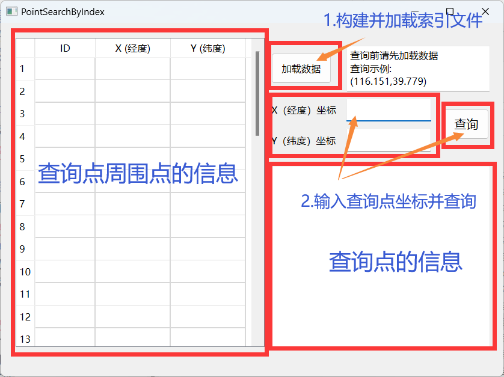
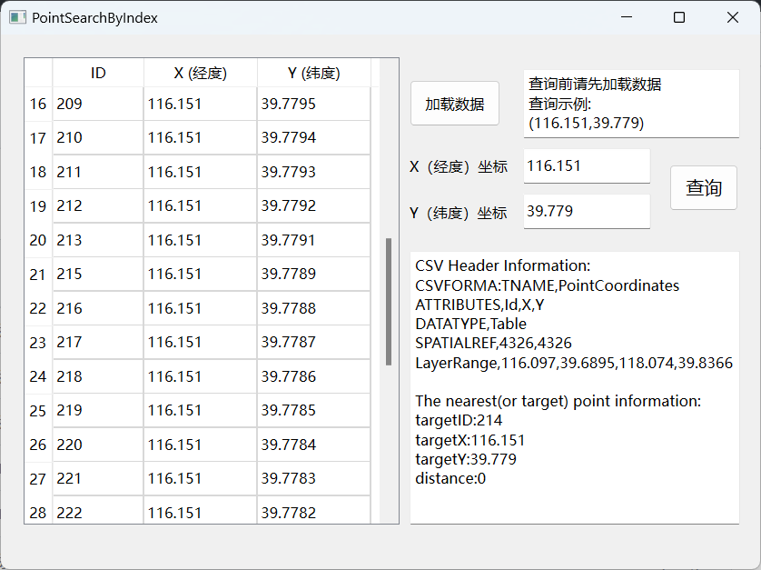

# PointSearchByIndex

## 摘要
>本程序主要通过读取CSV文件并构建预索引文件，实现寻找一组点数据中距离目标点最近的数据项的功能，并且使用了基于点的二分查找算法来优化查找效率  
>请点击：*[PointSearchByIndex](https://github.com/xiaosuqi1778/PointSearchByIndex)* 查看更多信息

## 程序使用说明
本程序核心界面说明如下：  
  
左侧展示查询点周围点的信息，右下侧展示CSV文件头信息（包括图层范围等）及查询结果。右上侧则给出了一个查询示例。      
以下是一个示例：  
  

## 读取CSV文件并构建索引文件
在之前程序 *[PointsSearch](https://github.com/xiaosuqi1778/PointsSearch)* 中,我们利用GDAL库实现了读取shp格式文件并将点数据（包括ID和经纬度）存储至CSV文件中的功能。  
本程序继承了该文件，根据前期发现，本次轨迹数据存在大量X坐标（经度）相同的点，故读取CSV文件 *[data.csv](../data.csv)* 按照X坐标（经度）进行排序，并将X相同的点归为同一块，在每一个块中的点，按Y坐标由小到大排序，最终得到索引文件 *[index.txt](../index.txt)*，而这些块的信息则在程序运行时存入内存中。  
就具体实现而言，本程序定义了一个`Block`类，每个`Block`实例表示一个块，其包含三个成员变量，分别表示块中第一个点的索引、块中最后一个点的索引和该块所有点的`x`坐标的中位数。
然后循环遍历所有点，使用两个变量`start`和`end`分别记录当前块的起始点和结束点的索引。当发现相邻两个点`x`坐标不同时，就构建一个新块，并将当前块的`start`和`end`放入新块中。  
最终，我们得到了一个有序的块序列`blocks`，每个块中的点都按照`y`坐标从小到大排序，并且块中的点的`x`坐标是相同的。这使得我们可以后续查找环节快速确定目标点所在的块，从而缩小查找范围。  
这是实现这一功能的核心代码：
```cpp
    //将X坐标（经度）相同的归为同一块
    string line;
    indexfile << "ID" << DELIMITER << "BLOCK" << endl; // 写入表头
    sort(allPoints.begin(), allPoints.end(), compareX);
    int group = 1;
    for (int i = 0; i < allPoints.size();){
        int start = i;
        double mid_x = allPoints[i].x;
        while (i < allPoints.size() && allPoints[i].x == mid_x){
            indexfile << allPoints[i].id << DELIMITER << group << endl;
            ++i;
        }
        blocks.emplace_back(start, i - 1, mid_x);
        group++;
    }
```
其中，`Point`结构体定义如下：
```cpp
struct Point {
    int id;
    double x;//经度
    double y;//纬度
};
```
`allPoints`是一个`Point`结构体的`vector`容器。  
根据程序运行结果，源文件约有13,000个点的信息，经过分块处理，只有约1,900个块，这在后续查找过程中将大幅优化查找速率，并节约内存。

## 按块查找匹配点的信息
在输入查询点的信息后，我们构建一个`Point`的实例`targetPoint`，然后我们遍历所有块并查找距离目标点`targetPoint`最近的点。  
对于每个块，我们先检查目标点是否在块的左侧或右侧，如果是，则计算目标点到该块中心点的距离；如果该距离小于当前最小距离，则在该块内查找距离目标点最近的点，并更新当前最小距离和对应的点编号；如果大于，则直接跳过，不必再计算查询点到该块中每个点的距离。对于当前块，我们也要在该块中查找距离目标点最近的点，并且更新当前最小距离和对应的点编号，由于本段代码较长，故用伪代码展示如下：
```py
# 查找最近的点
最近的点编号 = -1
最短距离 = 无穷大
for 每个 块 in 所有块集合:
    # 检查左侧块
    if 块.开始下标 > 0 and 
        (左侧块最近的点编号 := findNearestPointInBlock(块)) != -1 and
        (到左侧块距离 := abs(target.x - 块.中间点x)) < 最短距离 and
        (到左侧块最近点距离 := 距离(target, 左块最近点)) < 最短距离:
        最短距离 = 到左侧块最近点距离
        最近点编号 = 左侧块最近的点编号
    # 检查当前块
    if (最近的点编号于当前块 := findNearestPointInBlock(块)) != -1 and
        (到当前块最近点距离 := 距离(target, 当前块最近点)) < 最短距离:
        最短距离 = 到当前块最近点距离
        最近点编号 = 当前块最近的点编号
    # 检查右侧块
    if 块.结束下标 < 所有点数 - 1 and
        (右侧块最近的点编号 := findNearestPointInBlock(块)) != -1 and
        (距离到右侧块 := abs(块.中间点x - 目标点.x)) < 最短距离 and
        (到右侧块最近点距离 := 距离(target, 右块最近点)) < 最短距离:
        最短距离 = 到右侧块最近点距离
        最近点编号 = 右侧块最近的点编号
return 最近的点编号
```
在查找过程中涉及到了一个`findNearestPointInBlock`函数，该函数传入目标点、点集和块，输出离目标点最近的点的编号。它遍历块中所有的点，计算它们与目标点之间的距离，找出距离最近的点，并返回其编号，具体实现如下：
```cpp
int PointSearchByIndex::findNearestPointInBlock(const Block& block)
{
    double min_distance = MAX_NUM;
    int result_id = -1;

    for (int i = block.getStart(); i <= block.getEnd(); ++i){
        double distance = distanceSquare(targetPoint, allPoints[i]);
        if (distance < min_distance){
            min_distance = distance;
            result_id = allPoints[i].id;
        }
    }
    return result_id;
}
```

>作者：xiaosuqi1778，https://github.com/xiaosuqi1778  
>邮箱：<xiaosuqi1778@163.com>，<xusuqi9966@gmail.com>